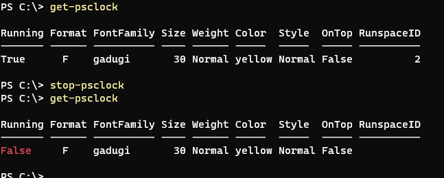
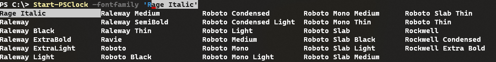
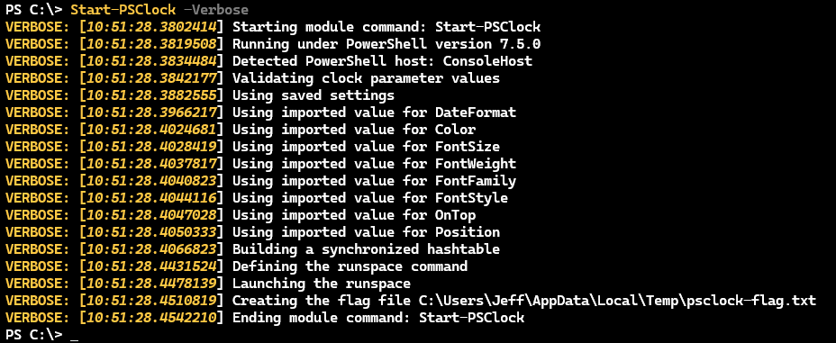

# PSClock Module Design

This document will provide technical details about how this module is designed. You might use this information to learn how to build your own PowerShell modules. Or you might use this information to troubleshoot a problem with the PSClock module.

## WPF Design

The WPF form is very simple. In the parent form is a Stack Panel which contains a Label control. The clock is nothing more than the text of the label control. Most PowerShell-based WPF scripts import some time of XAML content to define the form. The form in this module is so simple that it can be defined in code.

```powershell
$form = New-Object System.Windows.Window
$form.Title = "PSTimer"
$form.Height = 200
$form.Width = 400
$form.SizeToContent = "WidthAndHeight"
$form.AllowsTransparency = $True
$form.Background = "Transparent"
$stack = New-Object System.Windows.Controls.StackPanel
$label = New-Object System.Windows.Controls.label
$label.Content = <Datetime string>
$stack.AddChild($label)
$form.AddChild($stack)
```

The values to customize the appearance such as font style and color are passed as function parameters and then on to the form. Note that the code is defining some settings that aren't visible. But they remain for troubleshooting or debug purposes should I need them.

### Adding a Timer

Because this is a clock, I wanted it to update once a second. To make this work in my WPF form, I create a `DispatcherTimer` object and configure the tick interval to be 1 second.

```powershell
$timer = New-Object System.Windows.Threading.DispatcherTimer
$timer.Interval = [TimeSpan]"0:0:1.00"
```

Next, I need to create an event to run every time the timer ticks off another second.

```powershell
  $timer.Add_Tick({
      #update the label contents with the current date and time
  })
```

### Adding Events

The WPF form also includes a few other events. Because the form is transparent, there's nothing visible to grab and move the clock. I added an event to move the form when it was clicked and dragged with the left mouse button.

```powershell
$form.Add_MouseLeftButtonDown({ $form.DragMove() })
```

Even though there is a `Stop-PSClock` command to close the form, I also added another event to close the form with a right mouse click.

```powershell
$form.Add_MouseRightButtonUp({ _QuitClock })
```

The action is calling an internal private function that cleans up related files.

Finally, I added shortcuts to make it easy to re-size the clock using the <kbd>+</kbd> and <kbd>-</kbd> keys.

```powershell
$form.Add_KeyDown({
    switch ($_.key) {
        { 'Add', 'OemPlus' -contains $_ } {
            If ( $PSClockSettings.fontSize -ge 8) {
                $PSClockSettings.fontSize++
                $form.UpdateLayout()
            }
        }
        { 'Subtract', 'OemMinus' -contains $_ } {
            If ($PSClockSettings.FontSize -ge 8) {
                $PSClockSettings.FontSize--
                $form.UpdateLayout()
            }
        }
        { 'P' -contains $_ } {
            #show the preview settings form
            Show-PSClockSettingPreview
            }
    }
})
```

## Runspaces

When you create a WPF form and run it in PowerShell, because PowerShell is single-threaded, your prompt is blocked until the script creating the form completes. In this module the whole point is to keep the clock running on the desktop. The solution is to create a new runspace and run the WPF PowerShell code in it.

```powershell
$rs = [RunspaceFactory]::CreateRunspace()
$rs.ApartmentState = "STA"
$rs.ThreadOptions = "ReuseThread"
$rs.Open()
```

All of the code that creates the form is added to the runspace.

```powershell
PSCmd = [PowerShell]::Create().AddScript({
    #PowerShell code
})
#assign the command to the runspace
PSCmd.runspace = $rs
#launch the runspace
[void]PSCmd.BeginInvoke()
```

During development, I ran the WPF code directly in PowerShell. Only after I was satisfied with the results did I move it to the runspace.

### Synchronized Hashtable

Normally, you can't easily interact with anything running in a separate PowerShell runspace. However, you can take advantage of a _synchronized hashtable_. This is a special type of hashtable. In `Start-PSClock` I define a hashtable for the global scope.

```powershell
$global:PSClockSettings = [hashtable]::Synchronized(@{
    DateFormat       = $DateFormat
    FontSize         = $FontSize
    FontStyle        = $FontStyle
    FontWeight       = $FontWeight
    Color            = $Color
    FontFamily       = $FontFamily
    OnTop            = $OnTop
    StartingPosition = $Position
    CurrentPosition  = $Null
})
```

The keys and values are the function's parameters. The synchronized part means I can create the same hashtable in the runspace.

```powershell
$rs.SessionStateProxy.SetVariable("PSClockSettings", $global:PSClockSettings)
```

The runspace now has a variable called `$PSClockSettings`. If I make a change to the hashtable in either the global scope or the runspace, the other variable will be updated.

This means that I can use the global hashtable to control the runspace.

```powershell
if ($PSClockSettings.StartingPosition) {
        $form.left = $PSClockSettings.StartingPosition[0]
        $form.top = $PSClockSettings.StartingPosition[1]
    }
    else {
        $form.WindowStartupLocation = "CenterScreen"
    }
# ...
$label = New-Object System.Windows.Controls.label
$label.Content = Get-Date -Format $PSClockSettings.DateFormat

$label.HorizontalContentAlignment = "Center"
$label.Foreground = $PSClockSettings.Color
$label.FontStyle = $PSClockSettings.FontStyle
$label.FontWeight = $PSClockSettings.FontWeight
$label.FontSize = $PSClockSettings.FontSize
$label.FontFamily = $PSClockSettings.FontFamily
```

In the `Tick` event handler, I update the form and hashtable.

```powershell
if ($PSClockSettings.Running) {
    $label.Foreground = $PSClockSettings.Color
    $label.FontStyle = $PSClockSettings.FontStyle
    $label.FontWeight = $PSClockSettings.FontWeight
    $label.FontSize = $PSClockSettings.FontSize
    $label.FontFamily = $PSClockSettings.FontFamily
    $label.Content = Get-Date -Format $PSClockSettings.DateFormat

    $form.TopMost = $PSClockSettings.OnTop
    $form.UpdateLayout()

    $PSClockSettings.CurrentPosition = $form.left,$form.top
}
```

You can always view the "raw" hashtable from a PowerShell prompt.

```dos
PS C:\> $PSClockSettings

Name                           Value
----                           -----
FontSize                       65
CommandPath                    C:\scripts\psclock\functions
DateFormat                     F
Color                          Yellow
FontStyle                      Normal
Started                        3/31/2025 10:34:48 AM
OnTop                          False
Running                        True
StartingPosition               {61, 62}
Runspace                       System.Management.Automation.Runspaces.LocalRunspace
FontWeight                     Normal
FontFamily                     Freestyle Script
CurrentPosition                {61, 62}
```

### Set-PSClock

Because I didn't want to have to manually update the hashtable if I wanted to modify the clock, I `Set-PSClock` updates the hashtable. Using a function means I can document it and include features like `-WhatIf`.

```powershell
 $settings = "FontSize", "FontStyle", "FontWeight", "Color", "OnTop", "DateFormat", "FontFamily"
    if ($PSClockSettings -And $PSClockSettings.Running) {
        Foreach ($setting in $settings) {
            if ($PSBoundParameters.ContainsKey($setting)) {
                $value = $PSBoundParameters[$setting]
                $action = "Setting value to $value"
                Write-Verbose "Setting $setting to $value"
                if (PSCmdlet.ShouldProcess($setting, $action)) {
                    $Global:PSClockSettings[$setting] = $Value
                }
            }
        } #foreach setting
```

### Thread Jobs

When a new PSClock is created, it also creates a new runspace. You can see this by running `Get-Runspace`. Runspace information is stored in the `$PSClockSettings` synchronized hashtable.

```dos
PS C:\> Get-PSClock

Running Format FontFamily       Size Weight Color  Style  OnTop RunspaceID
------- ------ ----------       ---- ------ -----  -----  ----- ----------
True      F    Freestyle Script   65 Normal Yellow Normal False         11

PS C:\> Get-Runspace -id 11

 Id Name            ComputerName    Type          State         Availability
 -- ----            ------------    ----          -----         ------------
 11 Runspace11      localhost       Local         Opened        Busy
```

When the clock is closed, the runspace will remain. This is not necessarily a bad thing. Once you close your PowerShell session, the runspaces will be removed. But I wanted a cleaner way to clean up when a clock is closed.

In my event handler connected to quitting, I create a ThreadJob. This is similar to a PowerShell background job excepts it runs in the current thread. It doesn't create a new runspace. I have the runspace ID from the synchronized hashtable so I can start a new ThreadJob like this:

```powershell
 #define a thread job to clean up the runspace
$cmd = {
    Param([int]$ID)
    $r = Get-Runspace -Id $id
    $r.close()
    $r.dispose()
}
Start-ThreadJob -ScriptBlock $cmd -ArgumentList $PSClockSettings.runspace.id
```

When the clock closes, either with `Stop-PSClock` or a right-click, this code will run.

## Start-PSClock

The main function, `Start-PSClock`, generates the runspace, creates the synchronized hashtable and launches the WPF form. Once the clock is running, I can use `Set-PSClock` to modify it.

I tend to run multiple PowerShell windows and versions at the same time. While I could technically run the module in two different PowerShell sessions, it wouldn't make sense to have duplicate clocks.

### Flag File

When a new clock is created, `Start-PSClock` creates a _flag_ file in the user's TEMP folder. This is nothing more than a text file. The flag file variable is defined in the module file.

```powershell
$FlagPath = Join-Path -Path $env:temp -ChildPath psclock-flag.txt
```

The file is created in the `Start-PSClock` function. The file contains a timestamp and the user who started the clock.

```powershell
"[{0}] PSClock started by {1} under PowerShell process id $pid" -f (Get-Date), $env:USERNAME |  Out-File $FlagPath
```

The `Start-PSClock` command checks for this file, and if it is found, writes a warning message and then quits.

```powershell
if (Test-Path $FlagPath) {
    Write-Warning ($strings.FlagFound -f (Get-Content -path $FlagPath),$FlagPath)

    $r = Read-Host $strings.RemovePrompt
    if ($r -eq 'Y') {
        Remove-Item $FlagPath
    }
    else {
        #bail out
        Return
    }
}
```

In a different PowerShell session you'll get a result like this:

```dos
PS C:\> Start-PSClock

WARNING: A running clock has been detected from another PowerShell session on this desktop:

[3/31/2025 12:17:52 PM] PSClock started by Jeff under PowerShell process id 54672

If this is incorrect, delete C:\Users\Jeff\AppData\Local\Temp\psclock-flag.txt and try again.
```

The `_Quit` private function in `Start-PSClock` should delete this file.

```powershell
if (Test-Path $FlagPath) {
    Remove-Item $FlagPath
}
```

But, if the PowerShell session closes without stopping the clock, this code won't run and the flag file will remain. In this situation, you need to manually delete the file, as the warning instructs.

If you try to start another clock in the same session, `Start-PSClock` tests to see if one is already running.

```powershell
if ($PSClockSettings.Running) {
    Write-Warning "You already have a clock running. You can only have one clock running at a time."
    Return
}
```

## Save-PSClock

One of the design goals was to make it easy to start a clock using the last used settings. Granted, it wouldn't be that difficult to add a `Start-PSClock` command to a PowerShell profile script with all the parameters. But, I'd have to modify the profile script every time I decided to tweak a setting. Instead, `Save-PSClock` will export key properties to an XML file using `Export-Clixml`.

In the module file, a module-scoped variable is defined for the export path.

```powershell
$SavePath = Join-Path -Path $home -ChildPath PSClockSettings.xml
```

The `PSClockSettings.xml` will be stored in `$HOME`. Because I'm going to use the values from the `$PSClockSettings` synchronized hashtable with `Start-PSClock`, I need to "align" the property names.

```powershell
$props = @{Name="DateFormat";Expression={$_.Format}},"Color",
@{Name="FontSize";Expression={$_.Size}},
@{Name="FontWeight";Expression={$_.weight}},"FontFamily",
@{Name="FontStyle";Expression={$_.Style}},"OnTop",
@{Name="Position";Expression = {$_.CurrentPosition}}
```

This array is then used with `Select-Object` to export the custom properties.

```powershell
 Get-PSClock | Select-Object -property $props | Export-Clixml -Path $SavePath
```

In `Start-PSClock`, there is a test for the xml file. If found, it is imported and the values assigned to the function's parameters.

```powershell
if ((Test-Path $SavePath)-AND (-not $Force)) {
    Write-Verbose "[$((Get-Date).TimeOfDay) PROCESS] Using saved settings"
    $import = Import-Clixml -Path $SavePath
    foreach ($prop in $import.PSObject.properties) {
        Write-Verbose "[$((Get-Date).TimeOfDay) PROCESS] Using imported value for $($prop.name)"
        Set-Variable -name $prop.name -value $prop.Value
    }
}
```

In a function, each parameter becomes an internal variable. I can use `Set-Variable` to assign values to the parameters.

The initial design concept was that if the user specified any parameter value, then the saved file would be skipped. This proved to be too cumbersome. Instead, I opted for a `-Force` parameter. This allows the user to specify parameter values, or use the defaults and ignore any saved settings. The saved settings file will not be deleted in this situation. If you no longer wish to use the saved settings file, you can manually delete it.

## Formatting

The only true object that this module generates is from `Get-PSClock`. This function makes it easier to interact with the `$PSClockSettings` synchronized hashtable. Instead of writing a hashtable to the pipeline, the command creates a custom object.

```powershell
[PSCustomObject]@{
        PSTypeName      = "PSClock"
        Started         = $global:PSClockSettings.Started
        Format          = $global:PSClockSettings.DateFormat
        Output          = (Get-Date -Format $global:PSClockSettings.DateFormat)
        Running         = $global:PSClockSettings.Running
        FontFamily      = $global:PSClockSettings.FontFamily
        Size            = $global:PSClockSettings.fontSize
        Weight          = $global:PSClockSettings.FontWeight
        Color           = $global:PSClockSettings.Color
        Style           = $global:PSClockSettings.FontStyle
        OnTop           = $global:PSClockSettings.OnTop
        CurrentPosition = $global:PSClockSettings.CurrentPosition
        RunspaceID      = $global:PSClockSettings.Runspace.id
    }
```

The `PSTypeName` entry defines an object type.

```dos
PS C:\> Get-PSClock | Get-Member

   TypeName: PSClock

Name            MemberType   Definition
----            ----------   ----------
Equals          Method       bool Equals(System.Object obj)
GetHashCode     Method       int GetHashCode()
GetType         Method       type GetType()
ToString        Method       string ToString()
Color           NoteProperty string Color=Yellow
CurrentPosition NoteProperty Object[] CurrentPosition=System.Object[]
FontFamily      NoteProperty string FontFamily=Freestyle Script
Format          NoteProperty string Format=F
OnTop           NoteProperty switch OnTop=False
Output          NoteProperty System.String Output=Monday, March 31, 2025 10:42:19 AM
Running         NoteProperty bool Running=True
RunspaceID      NoteProperty int RunspaceID=46
Size            NoteProperty int Size=65
Started         NoteProperty System.DateTime Started=3/31/2025 10:34:48 AM
Style           NoteProperty string Style=Normal
Weight          NoteProperty string Weight=Normal
```

The object is defined with all the properties I might ever want to use. However, I only need to see a subset in most cases. This is no different than a command like `Get-Process`. The process object is very rich, but the command output provide a formatted view. I can do the same thing, but only if the object has a defined name, like `PSClock`.

I used the [New-PSFormatXML](https://jdhitsolutions.com/yourls/c8dc45) command from the [PSScriptTools](https://github.com/jdhitsolutions/PSScriptTools) module. This generated a format ps1xml file which is exported in the module manifest.

```powershell
 FormatsToProcess     = @('formats\psclock.format.ps1xml')
```

I tweaked the file to get the output I wanted. One change I made was to use ANSI formatting to highlight if a clock was not running.

```xml
<TableColumnItem>
<ScriptBlock>
if ($host.name -match "console|code" -AND (-Not $_.Running)) {
    "$([char]27)[91m$($_.Running)$([char]27)[0m"
}
else {
    $_.Running
}
</ScriptBlock>
</TableColumnItem>
```



## AutoCompletion

The last major design element is the use of auto-completion. I wanted tab completion for the font family and color parameters in `Start-PSClock` and `Set-PSClock`.

```powershell
Register-ArgumentCompleter -CommandName 'Start-PSClock', 'Set-PSClock' -ParameterName 'FontFamily' -ScriptBlock {
    param($commandName, $parameterName, $wordToComplete, $commandAst, $fakeBoundParameter)

    [System.Drawing.Text.InstalledFontCollection]::new().Families.Name |
    Where-Object { $_ -like "$($WordToComplete)*" } |
    ForEach-Object {
        # completion text,listitem text,result type,Tooltip
        [System.Management.Automation.CompletionResult]::new("'$($_)'", $_, 'ParameterValue', $_)
    }
}

Register-ArgumentCompleter -CommandName 'Start-PSClock', 'Set-PSClock' -ParameterName 'Color' -ScriptBlock {
    param($commandName, $parameterName, $wordToComplete, $commandAst, $fakeBoundParameter)

    [System.Drawing.Brushes].GetProperties().name | Select-Object -Skip 1 |
    Where-Object { $_ -Like "$($WordToComplete)*" } |
    ForEach-Object {
        # completion text,listitem text,result type,Tooltip
        [System.Management.Automation.CompletionResult]::new("'$($_)'", $_, 'ParameterValue', $_)
    }
}
```

The script block gets values from the .NET Framework and pipes to `Where-Object` so that I can use the `$WordToComplete` variable which allows me to start typing part of a value and then press tab.

For example, I can type `r` as a value for `FontFamily` then press <kbd>tab</kbd> to see all the possible values.



Or, I can press <kbd>tab</kbd> and cycle through all of the settings.

Some of the parameters in `Start-PSClock` have parameter validation using `ValidateSet()`

```powershell
[Parameter(HelpMessage = "Specify a font style.", ValueFromPipelineByPropertyName)]
[ValidateSet("Normal", "Italic", "Oblique")]
[alias("style")]
[string]$FontStyle = "Normal",
```

This too, provides an auto-completion experience.

## Custom Verbose

Localized string data and custom verbose messaging was introduced in module version 1.5.0. This centralizes the string data and makes it easier to localize. The strings are stored in a hashtable in `en-us\PSClock.psd1`.

```powershell
ConvertFrom-StringData @"
    SynchHash = Building a synchronized hashtable
    CantFind = Cant find a running PSClock. Do you need to start one?
    CreatingFlag = Creating the flag file {0}
    DefiningRunspace = Defining the runspace command
    DefiningWPF = Defining the WPF form and controls
    Detected = Detected PowerShell host: {0}
    ...
"@

This data is loaded on module import.

```powershell
if ((Get-Culture).Name -match '\w+') {
    Import-LocalizedData -BindingVariable strings
}
else {
    #force using En-US if no culture found, which might happen on non-Windows systems.
    Import-LocalizedData -BindingVariable strings -FileName PSClock.psd1 -BaseDirectory $PSScriptRoot\en-us
}
```

The functions use this string data for verbose messages and warning.

```powershell
_verbose ($strings.Starting -f $MyInvocation.MyCommand)
_verbose ($strings.Running -f $PSVersionTable.PSVersion)
_verbose ($strings.Detected -f $Host.Name)
```

The module uses a custom and private function called `_verbose` to display the verbose messages.

```powershell
function _verbose {
    [CmdletBinding()]
    Param([string]$Message)

    $m = "[$([char]27)[3m{0}$([char]27)[0m] {1}" -f (Get-Date).TimeOfDay, $Message
    Microsoft.PowerShell.Utility\Write-Verbose $m
}
```



## Learn More


If you feel that your PowerShell scripting skills need a boost, I'm assuming you've first read  [_Learn PowerShell Scripting in a Month of Lunches_](https://www.manning.com/books/learn-powershell-scripting-in-a-month-of-lunches?a_aid=jdhit&a_bid=2326a8ab). If so, then I suggest getting a copy of the [PowerShell Scripting and Toolmaking Book](https://leanpub.com/powershell-scripting-toolmaking/). Don Jones and I wrote this book intending it to be the definitive guide on everything you need to know to be a better PowerShell scripter and toolmaker.
