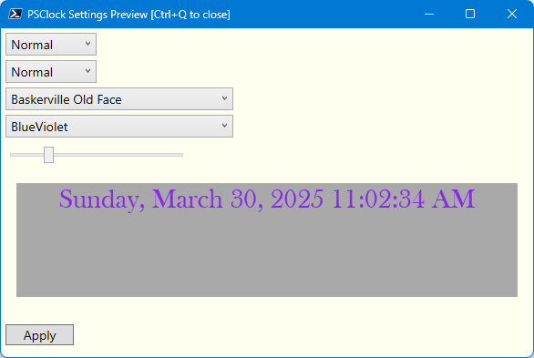

# PSClock


This module will create a WPF-based clock, launched from a PowerShell prompt that on your Windows desktop. The clock runs in a background PowerShell runspace so that it doesn't block. The module will automatically clean up the runspace when you close the clock. You can customize the clock's appearance including how you want to format the date and time. The clock's background is transparent so all you see is formatted text.

## Installation

If you are running Windows, you can install the module from the PowerShell Gallery. This module will work in Windows PowerShell and PowerShell 7 on Windows.

```powershell
Install-PSResource PSClock [-scope AllUsers]
```

Installing the module will also install the `Microsoft.PowerShell.ThreadJob` module if it isn't already installed. If you attempt to install the module with `Install-Module` and you have the legacy `ThreadJob` module installed, you might get a warning message. If this happens, run `Install-Module PSClock -AllowClobber`. This error doesn't seem to happen when using `Install-PSResource`.

## Module Commands

| Name                          | Alias       | Synopsis                                      |
|-------------------------------|-------------|----------------------------------------------|
| [Get-PrimaryDisplaySize](docs/Get-PrimaryDisplaySize.md) |             | Get the primary display size in pixels.      |
| [Get-PSClock](docs/Get-PSClock.md)           | *gpc*       | Get PSClock details.                         |
| [Save-PSClock](docs/Save-PSClock.md)         |             | Save current PSClock settings to a file.     |
| [Set-PSClock](docs/Set-PSClock.md)           | *spc*       | Modify a running PSClock.                    |
| [Show-FontPreview](docs/Show-FontPreview.md) |             | Show a font preview in a WPF form.           |
| [Show-PSClockSettingPreview](docs/Show-PSClockSettingPreview.md) |             | Show a GUI preview of PSClock settings.      |
| [Start-PSClock](docs/Start-PSClock.md)       | *psclock*   | Start a PSClock.                             |
| [Stop-PSClock](docs/Stop-PSClock.md)         |             | Stop a running PSClock.                      |

### [Start-PSClock](docs/Start-PSClock.md)

Use `Start-PSClock` or the `psclock` alias to launch a PSClock.

```powershell
Start-PSClock -size 24 -FontFamily 'Bahnschrift Light'
```

The font size must be at least 8. You should have tab completion for the `Color`, `FontFamily`, and other font-related parameters.

By default, the clock will be displayed on the center of your screen. You can click and drag the clock to reposition using the left mouse button. You might have to try a few times to "grab" the clock. You can close the clock with a right click or the `Stop-PSClock` command.

The command lets you specify any `DateTime` format string. This is the same value you would use in a command like `Get-Date -format U`. Note that these strings are case-sensitive. See https://docs.microsoft.com/en-us/dotnet/standard/base-types/custom-date-and-time-format-strings for more information.

```powershell
Start-PSClock -size 30 -Color Yellow -format G -FontFamily Verdana
```


### [Save-PSClock](docs/Save-PSClock.md)

You can use `Save-PSClock` to export current clock settings to an XML file.

```powershell
Save-PSClock
```

The file, `PSClockSettings.xml`, will be stored in `$HOME`. If the file is detected when you run `Start-PSClock`, the saved settings will be imported. If the file exists and you want to specify new settings, use the `-Force` parameter with `Start-PSClock`. This will not remove the saved settings file, only ignore it.

You need to manually delete the file if you no longer wish to use it. If you uninstall the module you will also need to manually delete the file.

### [Get-PSClock](docs/Get-PSClock.md)

Use this command to get information about the current clock.

```cmd
PS C:\> Get-PSClock

Running Format FontFamily Size Weight Color  Style  OnTop RunspaceID
------- ------ ---------- ---- ------ -----  -----  ----- ----------
True      G    Verdana      30 Normal Yellow Normal False         24
```

If the clock is not running, the `Running` value will be displayed in Red and there will be no `RunspaceID`. There are other properties to this object you might want to use.

```cmd
Started         : 3/30/2025 10:57:30 AM
Format          : G
Output          : 3/30/2025 10:59:49 AM
Running         : True
FontFamily      : Verdana
Size            : 30
Weight          : Normal
Color           : Yellow
Style           : Normal
OnTop           : False
CurrentPosition : {1729, 552}
RunspaceID      : 24
```

The `Output` property is a sample using the specified format string.

### [Set-PSClock](docs/Set-PSClock.md)

Use this command to modify the settings of a running PSClock.

```powershell
Set-PSClock -size 30 -color white -FontFamily 'Baskerville Old Face' -force
```


You can also increase the size by selecting the clock and using the <kbd>+</kbd> key. Decrease using the <kbd>-</kbd> key. Each change takes a second to be applied. You might need to "grab" the clock and move it slightly to ensure you have it selected.

If you only want to change the color, you can use PSReadLine to display a formatted list of color options. After the `-Color` parameter, press <kbd>Ctrl+Space</kbd> and answer `Y`.


Move the cursor to your selected choice and press <kbd>Enter</kbd>.

### Settings Preview Form

Version 1.4.0 updates the PSClock and allows you to configure the font family, style, and color via a WPF-based GUI. Select the clock and press `p` to display the form. The form elements have tooltips that explain each setting. Hover your mouse over the element to see the tooltip.



You can select a combination of font elements and view the preview. If you want to apply the new settings, click the `Apply` button. Don't forget to run `Save-PSClock` to save the settings if you want to re-use them the next time you start a clock.

You can also run `Show-PSClockSettingPreview`.

If you don't want to apply and changes, close the form.

### [Stop-PSClock](docs/Stop-PSClock.md)

Use this command to stop a running PSClock from the PowerShell prompt.

```powershell
Stop-PSClock
```

You can also right-click the clock to dismiss it, or close and remove the runspace it is using. You can still use `Get-PSClock` which should now reflect that a clock is not running.

```cmd
PS C:\> Get-PSClock

Running Format FontFamily           Size Weight Color Style  OnTop RunspaceID
------- ------ ----------           ---- ------ ----- -----  ----- ----------
False     G    Baskerville Old Face   30 Normal white Normal False
```

## Profile Integration

Ideally, you will start and stop the PSClock from the PowerShell prompt. This ensures that the flag file is removed. When you terminate a PowerShell session with a running clock, the flag file will not be removed. One way to ensure that the clock is stopped is to add the following code to your PowerShell profile. This will remove the flag file when you end the PowerShell session.

```powershell
Register-EngineEvent -SourceIdentifier PowerShell.Exiting -Action {
    If ($PSClockSettings.Running) {
        $flag = "$ENV:temp\psclock-flag.txt"
        If (Test-Path $flag) {
            Remove-Item $flag -Force
        }
        Stop-PSClock
    }
} | Out-Null
```

However, this will only run if you type `exit` to terminate the session. If you simply close the window, the `PowerShell.Exiting` event will not be triggered. You can also add the code to your profile to automatically start the clock when you open a new PowerShell session. In Windows Terminal, you still might need to manually close the profile tab once you see that the clock has ended.

## Runspaces and Limitations

The clock runs in a separate runspace launched from your PowerShell session. If you close the session, the clock will also be closed.

The command is designed to only have one clock running at a time. If you try to start another clock from another PowerShell session, you will get a warning.

```cmd
PS C:\> Start-PSClock
WARNING:
A running clock has been detected from another PowerShell session:

[3/30/2025 11:00:36 AM] PSClock started by Jeff under PowerShell process id 46900

If this is incorrect, delete C:\Users\Jeff\AppData\Local\Temp\psclock-flag.txt and try again.

Do you want to remove the flag file? Y/N:
```

If you close PowerShell without properly shutting down the clock you may be left with the flag file. Delete the file and try again.

## Font Preview

This module also includes a font preview utility. Run `Show-FontPreview` to display a WPF form that will let you preview different fonts.


You can use the arrow keys or buttons to navigate through the fonts. Press <kbd>Ctrl+Q</kbd> to quit or manually close the form.

## Module Design

For more details about the module design and technical implementation, read the [design document](Design.md).

## Related Modules

For a WPF-based countdown timer, take a look at the [Start-PSCountdownTimer](https://bit.ly/3T5ntz1) command in the [PSTimers](https://github.com/jdhitsolutions/PSTimers) module.

## Known Issues

There are no known issues at this time. Please post any bugs or feature requests in the [Issues](https://github.com/jdhitsolutions/PSClock/issues) section of this repository.
